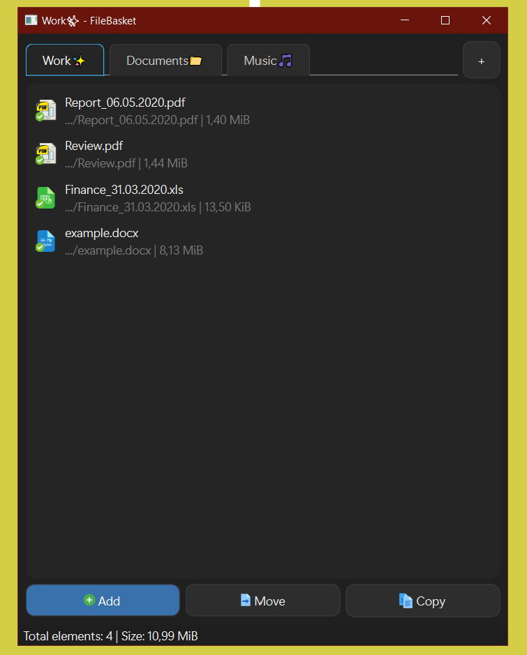

# 🗂️ FileBasket

A modern file organizer built with Qt.

> Simple. Fast. Tab-based.

    

---

## ✨ Features

- 📂 Tab-based file organization
- 🖱️ Drag & Drop support (files & folders)
- 🔁 Copy & Move operations
- 📊 File size tracking
- 💾 Session persistence
- 🧠 Smart duplicate detection

---

## 🖼️ Preview

---
## 💡 Why FileBasket?

Managing files across different folders can be messy and inefficient.

**FileBasket solves this problem** by letting you:

- Group files into tabs
- Quickly move or copy them
- Keep everything organized in one place

---

## 🛠️ Tech Stack

- C++
- Qt 6
- MVC Architecture

---

## 🎯 Goals of this project

- Learn Qt & Desktop development
- Build clean architecture (MVC)
- Practice UI/UX patterns

---

## ⚡ Future Plans

- 🔍 Search & filtering
- 🔄 Auto-updates
- 💎 Pro features
- 📁 File system watcher

---

## 📜 License

MIT